# Class Diagram Sistem Pemerintahan

## Struktur Organisasi dan Relasi Database

```mermaid
classDiagram
    %% Database Tables
    class User {
        +id: bigint
        +name: string
        +email: string
        +role: string
        +email_verified_at: timestamp
        +password: string
        +remember_token: string
        +timestamps()
    }

    class Penduduk {
        +id: bigint
        +user_id: bigint
        +nik: string
        +nama: string
        +alamat: text
        +jenis_kelamin: enum
        +tempat_lahir: string
        +tanggal_lahir: date
        +agama: string
        +status_perkawinan: string
        +pekerjaan: string
        +kewarganegaraan: string
        +timestamps()
    }

    class Document {
        +id: bigint
        +user_id: bigint
        +type: string
        +status: string
        +notes: text
        +file_path: string
        +nik: string
        +nama: string
        +alamat: text
        +tempat_lahir: string
        +tanggal_lahir: date
        +nama_ayah: string
        +nama_ibu: string
        +nama_almarhum: string
        +tanggal_meninggal: date
        +submitted_at: timestamp
        +timestamps()
    }

    class Berita {
        +id: bigint
        +judul: string
        +konten: text
        +gambar: string
        +penulis: string
        +user_id: bigint
        +status: enum
        +tanggal_publikasi: timestamp
        +timestamps()
    }

    class ActivityLog {
        +id: bigint
        +user_id: bigint
        +action: string
        +model_type: string
        +model_id: bigint
        +description: text
        +properties: json
        +timestamps()
    }

    class PasswordResetToken {
        +email: string
        +token: string
        +created_at: timestamp
    }

    class Session {
        +id: string
        +user_id: bigint
        +ip_address: string
        +user_agent: text
        +payload: longtext
        +last_activity: integer
    }

    %% Organizational Structure
    class KepalaDinas {
        +nama: Yudha
        +user_id: bigint
        +role: admin
        +bertanggungJawabKebijakanSeluruhSistem()
        +pengawasanSistem()
        +pengambilanKeputusanStrategis()
    }
    
    class DivisiAdministrasi {
        +nama: Divisi Administrasi dan Pelayanan Masyarakat
        +urusRegistrasiPenduduk()
        +manajemenDataPenduduk()
        +memastikanPelayananPublik()
    }
    
    class DivisiPengelolaanInfo {
        +nama: Divisi Pengelolaan Informasi dan Dokumentasi
        +urusanPengajuanDokumen()
        +manajemenBerita()
        +cetakDokumen()
    }
    
    class DivisiTeknologi {
        +nama: Divisi Teknologi dan Keamanan Sistem
        +kelolaInfrastrukturTeknologi()
        +keamananSistem()
        +desainUIUX()
        +pemantauanLogAktivitas()
    }
    
    class KepalaAdministrasi {
        +nama: Riyan
        +user_id: bigint
        +role: admin
        +koordinasiTugasDivisi()
        +memastikanLayananEfisien()
    }
    
    class PetugasVerifikasi {
        +nama: Bita
        +user_id: bigint
        +role: admin
        +prosesRegistrasiPendudukBaru()
        +verifikasiData()
    }
    
    class PetugasManajemenPenduduk {
        +nama: Dela
        +user_id: bigint
        +role: admin
        +crudDataPenduduk()
        +pencariDataBerdasarkanParameter()
        +jagaIntegritasData()
    }
    
    class KepalaPengelolaanInfo {
        +nama: Indah
        +user_id: bigint
        +role: admin
        +koordinasiPengelolaanDokumen()
        +koordinasiPengelolaanBerita()
    }
    
    class PetugasManajemenDokumen {
        +nama: Rara
        +user_id: bigint
        +role: admin
        +kelolaPengajuanDokumen()
        +prosesPersetujuanPenolakan()
    }
    
    class PetugasCetakDokumen {
        +nama: Satria
        +user_id: bigint
        +role: admin
        +konversiDokumenKePDF()
        +cetakDokumenDisetujui()
    }
    
    class PetugasManajemenBerita {
        +nama: Farel
        +user_id: bigint
        +role: admin
        +crudBerita()
        +uploadGambar()
        +penyusunanBerita()
    }
    
    class KepalaDivisiTeknologi {
        +nama: Vicky
        +user_id: bigint
        +role: admin
        +kelolaPengamananInfrastruktur()
        +pastikanPerformaOptimal()
    }
    
    class OperatorTI {
        +nama: Riyan
        +user_id: bigint
        +role: admin
        +jagaKestabilanServer()
        +kelolaKeamananData()
        +atasiMasalahTeknis()
    }
    
    class OperatorLogAktivitas {
        +nama: Pinky
        +user_id: bigint
        +role: admin
        +pantauLogAktivitas()
        +catatPerubahanData()
    }
    
    class DesainerUIUX {
        +user_id: bigint
        +role: admin
        +rancangAntarmuka()
        +pastikanPengalamanPengguna()
    }
    
    %% Database Relationships
    User "1" -- "1" Penduduk : has
    User "1" -- "0..*" Document : requests
    User "1" -- "0..*" Berita : creates
    User "1" -- "0..*" ActivityLog : generates
    User "1" -- "0..*" Session : maintains
    
    %% Organizational Relationships
    KepalaDinas --> DivisiAdministrasi : membawahi
    KepalaDinas --> DivisiPengelolaanInfo : membawahi
    KepalaDinas --> DivisiTeknologi : membawahi
    
    DivisiAdministrasi --> KepalaAdministrasi : dipimpin oleh
    DivisiAdministrasi --> PetugasVerifikasi : memiliki
    DivisiAdministrasi --> PetugasManajemenPenduduk : memiliki
    
    DivisiPengelolaanInfo --> KepalaPengelolaanInfo : dipimpin oleh
    DivisiPengelolaanInfo --> PetugasManajemenDokumen : memiliki
    DivisiPengelolaanInfo --> PetugasCetakDokumen : memiliki
    DivisiPengelolaanInfo --> PetugasManajemenBerita : memiliki
    
    DivisiTeknologi --> KepalaDivisiTeknologi : dipimpin oleh
    DivisiTeknologi --> OperatorTI : memiliki
    DivisiTeknologi --> OperatorLogAktivitas : memiliki
    DivisiTeknologi --> DesainerUIUX : memiliki
    
    %% Organizational to Database Relationships
    KepalaDinas --|> User : is a
    KepalaAdministrasi --|> User : is a
    PetugasVerifikasi --|> User : is a
    PetugasManajemenPenduduk --|> User : is a
    KepalaPengelolaanInfo --|> User : is a
    PetugasManajemenDokumen --|> User : is a
    PetugasCetakDokumen --|> User : is a
    PetugasManajemenBerita --|> User : is a
    KepalaDivisiTeknologi --|> User : is a
    OperatorTI --|> User : is a
    OperatorLogAktivitas --|> User : is a
    DesainerUIUX --|> User : is a
    
    PetugasManajemenPenduduk ..> Penduduk : manages
    PetugasManajemenDokumen ..> Document : manages
    PetugasCetakDokumen ..> Document : processes
    PetugasManajemenBerita ..> Berita : manages
    OperatorLogAktivitas ..> ActivityLog : monitors
```

## Penjelasan Integrasi Struktur Organisasi dan Database

Sistem pemerintahan ini mengintegrasikan struktur organisasi dengan database melalui beberapa relasi utama:

### 1. Peran Organisasi dan Tabel User
Semua posisi staf dalam struktur organisasi (Kepala Dinas, Kepala Divisi, Petugas, dll.) memiliki akun dalam sistem yang direpresentasikan dalam tabel `users`. Setiap posisi memiliki `role: admin` yang memberikan hak akses sesuai dengan jabatan mereka.

### 2. Divisi Administrasi dan Penduduk
- **Petugas Manajemen Data Penduduk** bertanggung jawab mengelola data dalam tabel `penduduk`
- Setiap penduduk memiliki akun dengan `role: user` dalam tabel `users`
- Relasi one-to-one antara `users` dan `penduduk` memastikan setiap penduduk memiliki satu data profil

### 3. Divisi Pengelolaan Informasi dan Dokumen
- **Petugas Manajemen Dokumen** bertugas mengelola pengajuan dokumen di tabel `documents`
- **Petugas Cetak Dokumen** bertugas mengkonversi dan mencetak dokumen yang telah disetujui
- **Petugas Manajemen Berita** bertugas mengelola berita pemerintahan di tabel `beritas`
- Relasi one-to-many antara `users` dan `documents` memungkinkan setiap penduduk dapat mengajukan banyak dokumen

### 4. Divisi Teknologi dan Keamanan
- **Operator Log & Aktivitas** bertanggung jawab memantau aktivitas sistem yang tercatat di tabel `activity_logs`
- Relasi one-to-many antara `users` dan `activity_logs` memungkinkan pencatatan semua aktivitas pengguna

## Alur Kerja Sistem

1. **Pendaftaran dan Verifikasi Penduduk**:
   - Penduduk melakukan registrasi (membuat akun di tabel `users`)
   - Petugas Verifikasi memvalidasi dan menyetujui pendaftaran
   - Data penduduk tersimpan di tabel `penduduk`

2. **Pengajuan Dokumen**:
   - Penduduk mengajukan dokumen (data masuk ke tabel `documents`)
   - Petugas Manajemen Dokumen memproses pengajuan
   - Petugas Cetak Dokumen menyiapkan dokumen untuk diunduh jika disetujui

3. **Manajemen Berita**:
   - Petugas Manajemen Berita membuat berita (data masuk ke tabel `beritas`)
   - Berita ditampilkan kepada publik sesuai status publikasi

4. **Monitoring Sistem**:
   - Operator Log & Aktivitas memantau semua aktivitas sistem yang terekam di tabel `activity_logs`
   - Kepala Divisi dan Kepala Dinas dapat melihat statistik dan laporan

## Keterangan Tambahan

- Tabel `documents` mendukung berbagai jenis dokumen (KTP, KK, Akta Kelahiran, Akta Kematian) dengan atribut berbeda
- Tabel `users` dengan atribut `role` membedakan antara admin (petugas pemerintahan) dan user (penduduk)
- Sistem mencatat semua aktivitas untuk audit dan monitoring keamanan
