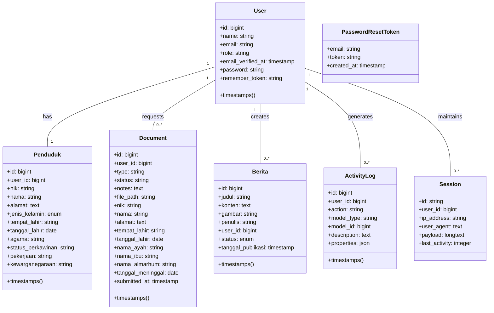

# Class Diagram Database Sistem Pemerintahan

## Penjelasan Relasi

1. **User - Penduduk**: Relasi one-to-one

    - Satu User dapat memiliki satu data Penduduk
    - FK: `user_id` pada tabel `penduduks` merujuk ke `id` pada tabel `users`

2. **User - Document**: Relasi one-to-many

    - Satu User dapat mengajukan banyak dokumen (KTP, KK, dll.)
    - FK: `user_id` pada tabel `documents` merujuk ke `id` pada tabel `users`

3. **User - Berita**: Relasi one-to-many

    - Satu User (Admin) dapat membuat banyak berita
    - FK: `user_id` pada tabel `beritas` merujuk ke `id` pada tabel `users`

4. **User - ActivityLog**: Relasi one-to-many

    - Aktivitas setiap User dicatat dalam activity logs
    - FK: `user_id` pada tabel `activity_logs` merujuk ke `id` pada tabel `users`

5. **User - Session**: Relasi one-to-many
    - Satu User dapat memiliki beberapa session aktif
    - FK: `user_id` pada tabel `sessions` merujuk ke `id` pada tabel `users`

## Keterangan Tambahan

- Tabel `documents` memiliki berbagai atribut berbeda untuk mendukung tipe dokumen yang berbeda (KTP, KK, Akta Kelahiran, Akta Kematian)
- Tabel `users` memiliki atribut `role` yang membedakan hak akses (admin atau user)
- Sistem mencatat aktivitas pengguna di tabel `activity_logs` untuk audit dan monitoring

## Alur dan Tugas Entitas dalam Website

### User (Pengguna)
- **Registrasi dan Login**: Pengguna harus melakukan registrasi dan login untuk mengakses sistem
- **Role-based Access**: Terdapat dua role - Admin dan Penduduk (regular user)
- **Penduduk**:
  - Mengisi data diri (NIK, nama, alamat, dll)
  - Mengajukan berbagai dokumen (KTP, KK, Akta Kelahiran, Akta Kematian)
  - Melihat status pengajuan dokumen
  - Mengunduh/mencetak dokumen yang telah disetujui
  - Melihat berita pemerintahan
- **Admin**:
  - Mengelola data penduduk
  - Memproses pengajuan dokumen (menyetujui/menolak)
  - Mengelola berita (membuat, mengedit, menghapus)
  - Melihat log aktivitas pengguna

### Document (Dokumen)
- **Pengajuan Dokumen**:
  - Penduduk mengisi formulir pengajuan sesuai jenis dokumen
  - Sistem menyimpan data dengan status "DIPROSES"
- **Pemrosesan Dokumen**:
  - Admin memeriksa pengajuan dokumen
  - Admin menyetujui atau menolak pengajuan
  - Jika disetujui: status menjadi "SELESAI" dan dokumen PDF dibuat
  - Jika ditolak: status menjadi "DITOLAK" dan admin memberikan alasan
- **Pengambilan Dokumen**:
  - Penduduk melihat status dokumen
  - Penduduk dapat melihat preview, mengunduh, dan mencetak dokumen yang disetujui
  - Penduduk dapat melihat alasan penolakan untuk dokumen yang ditolak

### Berita
- **Admin**:
  - Membuat berita baru dengan judul, konten, dan gambar
  - Mengedit berita yang sudah ada
  - Menghapus berita
  - Mengatur status publikasi berita
- **Penduduk**:
  - Melihat daftar berita
  - Membaca detail berita

### ActivityLog (Log Aktivitas)
- **Sistem**:
  - Mencatat setiap aktivitas penting pengguna
  - Menyimpan informasi user, tipe aktivitas, model yang terdampak, dan deskripsi
- **Admin**:
  - Melihat dan memfilter log aktivitas
  - Menggunakan log untuk audit dan monitoring keamanan

### Penduduk
- **Pengelolaan Data**:
  - Penduduk mengisi data pribadi lengkap
  - Data digunakan untuk pengajuan dokumen
  - Admin dapat mengelola data penduduk

### Session dan PasswordResetToken
- **Keamanan**:
  - Mengelola sesi pengguna
  - Menangani reset password
  - Menjaga keamanan akses pengguna
